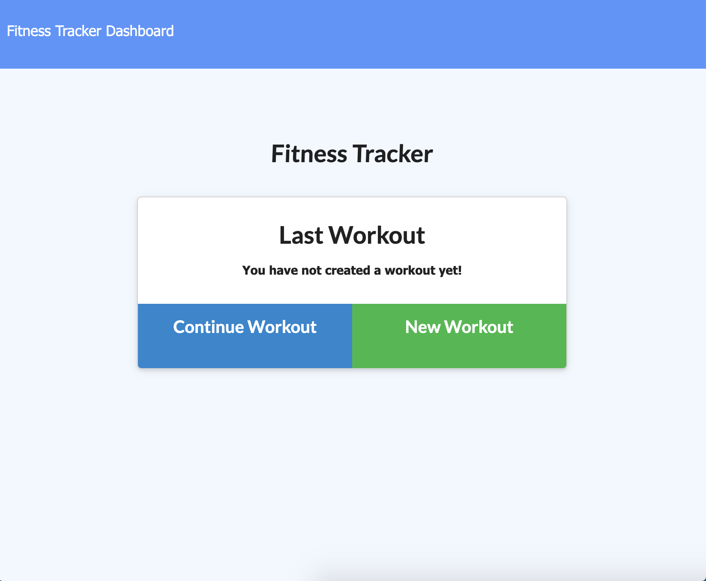

# Fitness-Tracker
Fitness Tracking app with node/express server and mongodb.

## Deployment
https://evening-hollows-00757.herokuapp.com/
## Installation
This app has 3 npm dependancies express, mongoose and morgan. Please run and `npm i` to install dependancies.

## Usage
Track your workouts and exercieses with this application. Create a new workout and add exercises. First pick between Resistance or Cardio. After selecting a type enter the workout and its detail, such as duration, weight, and distance. After enter the details they will be saved to the mongo database. User can then access `/stats` where they are able to see charts of their past workouts and exercises.

## Screenshots

## LICENSE
